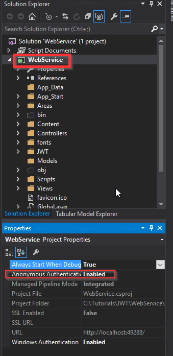
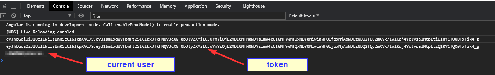

# How to: Angular + ASPNET WebAPI + Windows Authentication + CORS + JWT
## Scenario
We need an intranet web app that allows the user to login automatically with windows authentication, but also it is required to be able to logout from the app and login manually with a different username and password. Client and Server are in different locations (domains)
For this we need:
* ASPNet WebAPI service with
  * Windows Auth
  * Anonynous Auth
  * JWT support
  * CORS support
* Basic Angular app

## Environment
* Visual Studio 2015
* .NetFramework 4.8
* Angular CLI 10.1.3
* Node 10.15.3
* Windows 10
## Requirements
* Read https://jwt.io/introduction/
* Read https://stackoverflow.com/a/40284152/3596441
  
## Steps
### AspNet WebAPI Service

1. Create the WebAPI with windows authentication enabled
2. [Enable CORS](https://softdevnotesntips.blogspot.com/2020/09/how-to-enable-cors-between-angular-app.html)
3. [Configure it, so it returns JSON instead of XML](https://softdevnotesntips.blogspot.com/2020/09/connect-angular-with-webapi.html)
4. Enable ***Anonymous Authentication***    
   
5. Install JWT support
   ```
   install-package System.IdentityModel.Tokens.Jwt
   ```   
6. Create a folder named ***JWT*** and inside add these classes

    <details>
    <summary>AddChallengeOnUnauthorizedResult</summary>

    ```csharp
        public class AddChallengeOnUnauthorizedResult : IHttpActionResult
        {
            public AddChallengeOnUnauthorizedResult(AuthenticationHeaderValue challenge, IHttpActionResult innerResult)
            {
                Challenge = challenge;
                InnerResult = innerResult;
            }
            public AuthenticationHeaderValue Challenge { get; }
            public IHttpActionResult InnerResult { get; }
            public async Task<HttpResponseMessage> ExecuteAsync(CancellationToken cancellationToken)
            {
                HttpResponseMessage response = await InnerResult.ExecuteAsync(cancellationToken);
                if (response.StatusCode == HttpStatusCode.Unauthorized)
                {
                    // Only add one challenge per authentication scheme.
                    if (response.Headers.WwwAuthenticate.All(h => h.Scheme != Challenge.Scheme))
                    {
                        response.Headers.WwwAuthenticate.Add(Challenge);
                    }
                }
                return response;
            }
        }
    ```
    </details>  
    <details>
    <summary>AuthenticationFailureResult</summary>

    ```csharp
        public class AuthenticationFailureResult : IHttpActionResult
        {
            public AuthenticationFailureResult(string reasonPhrase, HttpRequestMessage request)
            {
                ReasonPhrase = reasonPhrase;
                Request = request;
            }
            public string ReasonPhrase { get; }
            public HttpRequestMessage Request { get; }
            public Task<HttpResponseMessage> ExecuteAsync(CancellationToken cancellationToken)
            {
                return Task.FromResult(Execute());
            }
            private HttpResponseMessage Execute()
            {
                HttpResponseMessage response = new HttpResponseMessage(HttpStatusCode.Unauthorized)
                {
                    RequestMessage = Request,
                    ReasonPhrase = ReasonPhrase
                };
                return response;
            }
        }
    ```
    </details>
    <details>
        <summary>HttpAuthenticationChallengeContextExtensions</summary>

    ```csharp
        public static class HttpAuthenticationChallengeContextExtensions
        {
            public static void ChallengeWith(this HttpAuthenticationChallengeContext context, string scheme)
            {
                ChallengeWith(context, new AuthenticationHeaderValue(scheme));
            }

            public static void ChallengeWith(this HttpAuthenticationChallengeContext context, string scheme, string parameter)
            {
                ChallengeWith(context, new AuthenticationHeaderValue(scheme, parameter));
            }

            public static void ChallengeWith(this HttpAuthenticationChallengeContext context, AuthenticationHeaderValue challenge)
            {
                if (context == null)
                {
                    throw new ArgumentNullException(nameof(context));
                }

                context.Result = new AddChallengeOnUnauthorizedResult(challenge, context.Result);
            }
        }    
    ```    
    </details>
    <details>
        <summary>JwtAuthenticationAttribute</summary>

    ```csharp
        public class JwtAuthenticationAttribute : Attribute, IAuthenticationFilter
        {
            public string Realm { get; set; }
            public bool AllowMultiple => false;

            public async Task AuthenticateAsync(HttpAuthenticationContext context, CancellationToken cancellationToken)
            {
                var request = context.Request;
                var authorization = request.Headers.Authorization;

                if (authorization == null || authorization.Scheme != "Bearer")
                {
                    context.ErrorResult = new AuthenticationFailureResult("Authorization header not set", request);
                    return;
                }

                if (string.IsNullOrEmpty(authorization.Parameter))
                {
                    context.ErrorResult = new AuthenticationFailureResult("Missing Jwt Token", request);
                    return;
                }

                var token = authorization.Parameter;
                var principal = await AuthenticateJwtToken(token);

                if (principal == null)
                    context.ErrorResult = new AuthenticationFailureResult("Invalid token", request);

                else
                    context.Principal = principal;
            }

            private static bool ValidateToken(string token, out string username)
            {
                username = null;

                var simplePrinciple = JwtManager.GetPrincipal(token);
                var identity = simplePrinciple?.Identity as ClaimsIdentity;

                if (identity == null)
                    return false;

                if (!identity.IsAuthenticated)
                    return false;

                var usernameClaim = identity.FindFirst(ClaimTypes.Name);
                username = usernameClaim?.Value;

                if (string.IsNullOrEmpty(username))
                    return false;

                // More validate to check whether username exists in system

                return true;
            }

            protected Task<IPrincipal> AuthenticateJwtToken(string token)
            {
                string username;
                if (ValidateToken(token, out username))
                {
                    // based on username to get more information from database in order to build local identity
                    var claims = new List<Claim>
                    {
                        new Claim(ClaimTypes.Name, username)
                        // Add more claims if needed: Roles, ...
                    };

                    var identity = new ClaimsIdentity(claims, "Jwt");
                    IPrincipal user = new ClaimsPrincipal(identity);

                    return Task.FromResult(user);
                }

                return Task.FromResult<IPrincipal>(null);
            }

            public Task ChallengeAsync(HttpAuthenticationChallengeContext context, CancellationToken cancellationToken)
            {
                Challenge(context);
                return Task.FromResult(0);
            }

            private void Challenge(HttpAuthenticationChallengeContext context)
            {
                string parameter = null;

                if (!string.IsNullOrEmpty(Realm))
                    parameter = "realm=\"" + Realm + "\"";

                context.ChallengeWith("Bearer", parameter);
            }
        }
    ```    
    </details>
    <details>
        <summary>JwtManager</summary>

    ```csharp
        public static class JwtManager
        {
            /// <summary>
            /// Use the below code to generate symmetric Secret Key
            ///     var hmac = new HMACSHA256();
            ///     var key = Convert.ToBase64String(hmac.Key);
            /// </summary>
            private const string Secret = "db3OIsj+BXE9NZDy0t8W3TcNekrF+2d/1sFnWG4HnV8TZY30iTOdtVWJG8abWvB1GlOgJuQZdcF2Luqm/hccMw==";

            public static string GenerateToken(string username, int expireMinutes = 20)
            {
                var symmetricKey = Convert.FromBase64String(Secret);
                var tokenHandler = new JwtSecurityTokenHandler();

                var now = DateTime.UtcNow;
                var tokenDescriptor = new SecurityTokenDescriptor
                {
                    Subject = new ClaimsIdentity(new[]
                            {
                                new Claim(ClaimTypes.Name, username)
                            }),

                    Expires = now.AddMinutes(Convert.ToInt32(expireMinutes)),

                    SigningCredentials = new SigningCredentials(new SymmetricSecurityKey(symmetricKey), SecurityAlgorithms.HmacSha256Signature)
                };

                SecurityToken securityToken = tokenHandler.CreateToken(tokenDescriptor);
                var token = tokenHandler.WriteToken(securityToken);

                return token;
            }

            public static ClaimsPrincipal GetPrincipal(string token)
            {
                try
                {
                    var tokenHandler = new JwtSecurityTokenHandler();
                    var jwtToken = tokenHandler.ReadToken(token) as JwtSecurityToken;

                    if (jwtToken == null)
                        return null;

                    var symmetricKey = Convert.FromBase64String(Secret);

                    var validationParameters = new TokenValidationParameters()
                    {
                        RequireExpirationTime = true,
                        ValidateIssuer = false,
                        ValidateAudience = false,
                        IssuerSigningKey = new SymmetricSecurityKey(symmetricKey)
                    };

                    SecurityToken _;
                    var principal = tokenHandler.ValidateToken(token, validationParameters, out _);

                    return principal;
                }

                catch (Exception)
                {
                    return null;
                }
            }
        }    
    ```
    </details>   
7. Create the following ***Api*** controllers
    * ***TokensController***
    ```csharp
        public class TokenController : ApiController
        {
            //Windows auth required
            [Authorize]
            public string Get()
            {
                string user = User.Identity.Name;
                return JwtManager.GenerateToken(user);
            }
        }
    ```
    * ***ItemsController***
    ```csharp
        public class ItemsController : ApiController
        {
            [JwtAuthentication]
            public string Get()
            {
                return User.Identity.Name;
            }
        }
    ```
8. Open ***App_Start/WebApiConfig.cs*** and one more header to the ***CORS*** attribute constructor, the ***Authorization*** header, also change the ***origins*** parameter to "*"
   ```csharp
   ...
    EnableCorsAttribute cors = new EnableCorsAttribute("*", "Accept, Authorization, Origin, Content-Type, X-Auth-Token, cache-control, x-requested-with", "GET, POST ,PATCH, PUT, DELETE, OPTIONS");
   ... 
   ```   
### Angular app
1. Create the angular app
2. Create the following services
   * ***TokensService***
   ```typescript
    import { HttpClient } from '@angular/common/http';
    import { Injectable } from '@angular/core';
    import { map,tap } from 'rxjs/operators';
    @Injectable({
    providedIn: 'root'
    })
    export class TokensService {
    constructor(private httpClient: HttpClient) { }
    token: string;
    getToken = () => {
        return this.httpClient.get('http://localhost:49288/api/token', { withCredentials: true })
        .pipe(
            tap((x: string) => {
            if (x) {
                this.token = x;
                console.log(this.token);
                localStorage.setItem('token', JSON.stringify(this.token));
            }
            })
        );
    }
    }   
   ```
   * ***ItemsService***
    ```typescript
    import { TokensService } from './tokens.service';
    import { HttpClient, HttpHeaders } from '@angular/common/http';
    import { Injectable } from '@angular/core'   
    @Injectable({
    providedIn: 'root'
    })
    export class ItemsService    
    constructor(private httpClient: HttpClient, private tokenService: TokensService) { }     
    httpOptions = {
        headers: new HttpHeaders({})
    };   
    getItems = () => {
        if (this.tokenService.token) {
        this.httpOptions.headers = this.httpOptions.headers.set('Authorization', 'Bearer ' + this.tokenService.token);
        }
        return this.httpClient.get('http://localhost:49288/api/items', this.httpOptions);
    }
    }
    ```
3. Alter ***app.component.html***
   ```html
   <h1>{{value}}</h1>
   ```    
4. Alter ***app.component.ts***
   ```typescript
    import { TokensService } from './services/tokens.service';
    import { ItemsService } from './services/items.service';
    import { Component, OnInit } from '@angular/core';

    @Component({
    selector: 'app-root',
    templateUrl: './app.component.html',
    styleUrls: ['./app.component.css']
    })
    export class AppComponent implements OnInit {
    constructor(private itemsService: ItemsService, private tokenService: TokensService) { }
    value: any;

    ngOnInit(): void {
        this.tokenService.getToken()
        .subscribe((t) => {
            console.log(t);

            this.itemsService.getItems()
            .subscribe((its) => {
                console.log(its);
                this.value = its;
            },
                (err) => console.error(err)
            );
        });
    }
    }   
   ```   
5. Run both apps, press F12 on the angular app to open the developer tools, you should see something like this:
   

### What happened?
The first time the application runned, it went to the Tokens controller where using Windows authentication a token was generated and returned, then, that token was used to make the http call to the Items Controller where JWT authorization was performed.   
## Resources
* All content extracted from this answer in SO: https://stackoverflow.com/questions/40281050/jwt-authentication-for-asp-net-web-api
* https://stackoverflow.com/a/36506031/3596441
* https://softdevnotesntips.blogspot.com/2020/09/connect-angular-with-webapi.html
* https://github.com/cuongle/WebApi.Jwt/ (Warning, original code has a bug, see [this pull request](https://github.com/cuongle/WebApi.Jwt/pull/4))
